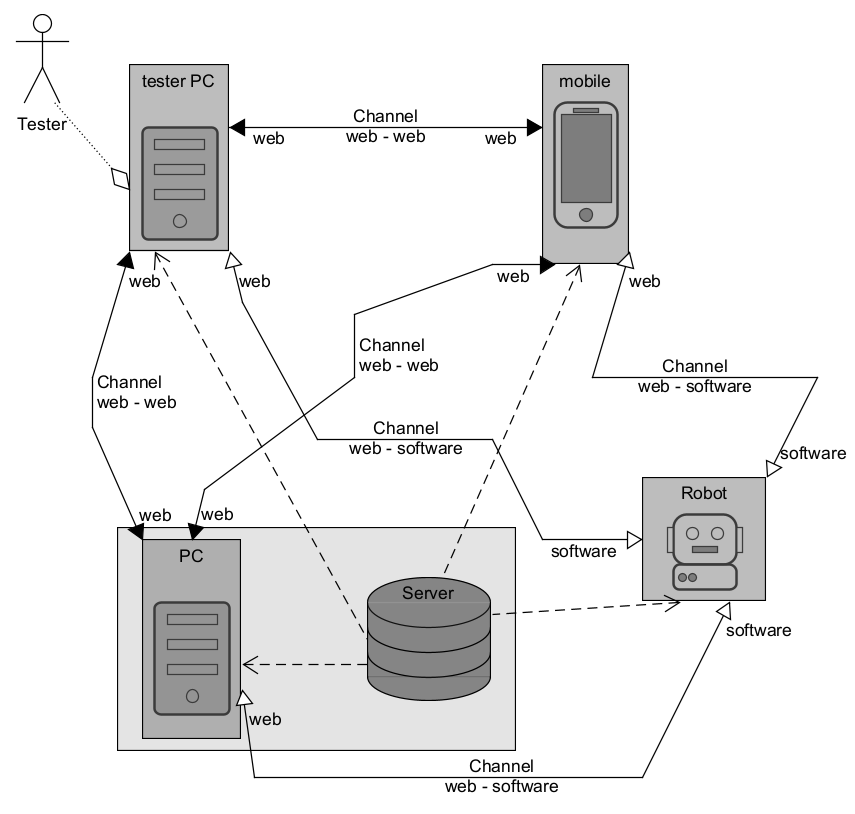

# Introduction

This project is a comprehensive integration of modern software and hardware technologies, designed to control a robotic rover using a combination of Python, Electron, ROS 2, Django, and micro-ROS. The system bridges web technologies, embedded systems, and robotics to enable real-time communication, advanced robot control, and seamless collaboration. By leveraging tools like FreeRTOS and Tailscale, it ensures efficiency, scalability, and robust remote access.



## Key Components and Features:
### Python-Based ROS 2 Package:

- Provides control for the rover’s wheels using velocity commands (geometry_msgs/Twist) published to ROS 2 topics (/diff_drive_controller_left/cmd_vel_unstamped and /diff_drive_controller_right/cmd_vel_unstamped).
- Includes a Python publisher for programmatic control and CLI tools for quick testing and debugging.
### Backend API with Django:

- Facilitates real-time text chat and robotic control via a Python-based server.
- Integrates advanced features like speech recognition and LLM-powered interactions.
- Supports remote sharing and collaboration using Tailscale for secure access.
### Electron-Based Frontend:

- Acts as a user-friendly interface for interacting with the rover.
- Supports synchronized chat and WebSocket-based communication for real-time robot control.
- Features cross-platform compatibility for deployment on various devices.
### Micro-ROS on ESP32:

- Enables lightweight communication between the ESP32 microcontroller and ROS 2.
- Uses FreeRTOS for real-time task management, ensuring efficient operation of motors, sensors, and communication tasks.
- Publishes commands to ROS 2 topics over Wi-Fi using UDP transport.
### FreeRTOS and ESP-IDF Integration:

- Provides a robust multitasking environment on ESP32 for handling communication, motor control, and sensor data.
- Ensures deterministic behavior essential for real-time robotic applications.
## Use Cases:
- **Robotic Rover Control**: Send movement commands, enable remote keyboard navigation, and leverage advanced features like audio/video management and speech-based interactions.
- **Real-Time Communication**: Synchronized chat across multiple platforms with live feedback and terminal integration.
- **Collaborative Development**: Remote access via Tailscale, allowing multiple users to test and interact with the system in distributed environments.
- **IoT and Robotics Integration**: Seamless communication between embedded devices and ROS 2 nodes for scalable IoT applications.

# Testing (after initial configuration of all project components available in appropriate subfolders)

1. setup django server
```
cd ~/Web_Speech_remote_control/api
poetry run python manage.py runserver 0.0.0.0:8000
```

2. setup tailscale
```
sudo tailscale funnel 8000
```
go to website

3. setup electron app
```
cd ~/Web_Speech_remote_control/electron
npm run start
```

4. Turn on rover

5. create wifi connection with esp32 
```
sudo docker run -it --rm --net=host microros/micro-ros-agent:humble udp4 --port 8888 -v6
```

6. start testing all components

7. terminal tests
```
ros2 topic pub /diff_drive_controller_right/cmd_vel_unstamped geometry_msgs/msg/Twist "{linear: {x: 2.0, y: 0.0, z: 0.0}, angular: {x: 0.0, y: 0.0, z: 0.0}}"


ros2 topic pub /diff_drive_controller_left/cmd_vel_unstamped geometry_msgs/msg/Twist "{linear: {x: 2.0, y: 0.0, z: 0.0}, angular: {x: 0.0, y: 0.0, z: 0.0}}"

```

8. setup depthai

```
sudo nano /etc/udev/rules.d/80-depthai.rules
```
SUBSYSTEM=="usb", ATTR{idVendor}=="03e7", MODE="0666"
```
 sudo udevadm control --reload-rules
```

9. running oak camera depthai_viewer

```
python3 -m depthai_viewer

```